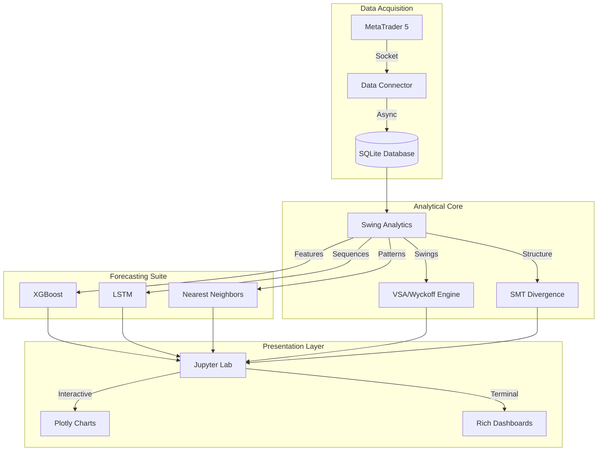

# Midas Project 🔱 - Zaawansowana Analityka Market Context

## BOT STATUS LOG (V3.0 - Swing & ML Integration)

```json
{
    "project_name": "Midas Project",
    "project_version": "2.2.0-alpha",
    "last_updated": "2026-01-18T13:30:00Z",
    "status": "LIVE_ANALYTICS_ACTIVE",
    "overall_progress_percent": 85,
    "tech_stack": {
        "core": "Python 3.12+",
        "data_source": "MetaTrader 5 (Direct Terminal)",
        "database": "SQLite 3",
        "ml_models": ["XGBoost", "LSTM", "Nearest Neighbors"],
        "visualization": ["Plotly Interactive", "Rich Dashboard"]
    },
    "progress_log": [
        {
            "step": 1,
            "task": "ZigZag & Swing Logic",
            "description": "Implemented proprietary ZigZag engine with automated HL/HH/LL/LH classification.",
            "status": "COMPLETE"
        },
        {
            "step": 2,
            "task": "ML Forecasting Suite",
            "description": "Integrated XGBoost and LSTM for price/time targets.",
            "status": "STABLE"
        },
        {
            "step": 3,
            "task": "Jupyter Dashboard V2.2",
            "description": "Interactive swing maps with cross-referenced statistical tables.",
            "status": "LIVE"
        }
    ],
    "next_milestone": "Full Backtest Walk-forward Stabilization"
}
```

---

## 🛠️ KOMPLETNY TASK BREAKDOWN

### **MODUŁ 1: CORE DATA & ENGINE**

| Step | Task | Opis / Wymagany Rezultat | Weryfikacja |
| :--- | :--- | :--- | :--- |
| **01** | **MT5 Connector** | Moduł `data_connector.py`. Stabilne pobieranie świec M1-D1, obsługa reconnecta. | ✅ Połączenie nawiązane |
| **02** | **ZigZag Engine** | Implementacja `SwingAnalytics`. Wykrywanie pivotów zgodnie z Depth/Deviation/Backstep. | ✅ Pivoty zgodne z MT5 |
| **03** | **Swing Classification** | Logika w `process_swings`. Rozpoznawanie Trendu (Bullish/Bearish) i Pullbacków. | ✅ Poprawne HH/HL/LL/LH |
| **04** | **Database Layer** | `database.py`. Przechowywanie historii cen, wyników analiz i sygnałów behawioralnych. | ✅ SQLite zapisuje dane |

### **MODUŁ 2: ML & FORECASTING**

| Step | Task | Opis / Wymagany Rezultat | Weryfikacja |
| :--- | :--- | :--- | :--- |
| **05** | **Nearest Neighbors** | Dopasowywanie aktualnych swingów do wzorców historycznych. | ✅ Pattern matching działa |
| **06** | **XGBoost Regressor** | Predykcja `range` i `duration` kolejnego swingu na podstawie 75-barowego okna. | ✅ MAPE < 15% |
| **07** | **LSTM RNN** | Sekwencyjna analiza zmian ceny dla prognoz krótkoterminowych. | ✅ Model trenuje bez błędu |

### **MODUŁ 3: WIZUALIZACJA I DASHBOARDY**

| Step | Task | Opis / Wymagany Rezultat | Weryfikacja |
| :--- | :--- | :--- | :--- |
| **08** | **Interactive Swing Map** | Plotly w `midas.ipynb`. Numeracja swingów, adnotacje Volume/Length/Duration. | ✅ Adnotacje plynne |
| **09** | **Rich Dashboard** | `swing_dashboard.py`. Tabele statystyczne (Progression, Volume, Time) z cross-reference ID. | ✅ ID tabel = ID wykresu |
| **10** | **Exhaustion Score** | Panel wizualizujący zmęczenie trendu na podstawie SMT i VSA. | ✅ Sygnały Climax widoczne |

---

## 🏗️ Architektura Systemu



---

## 🚀 Szybki Start

### 1. Środowisko
Upewnij się, że masz Python 3.12 i MT5 uruchomiony.
```bash
pip install -r requirements.txt
```

### 2. Analiza live
Uruchom `main.py`, aby zaktualizować bazę i zobaczyć predykcje w terminalu:
```bash
python main.py
```

### 3. Eksploracja danych
Uruchom Jupyter Lab i otwórz `midas.ipynb`:
```powershell
.\run_jupyter.ps1
```

---

## 📊 VSA & Behavioral Patterns
Projekt Midas wykracza poza zwykłe wskaźniki, implementując:
-   **Springs & Upthrusts**: Pułapki płynności.
-   **SOT (Shortening of Thrust)**: Zanik impetu ruchu.
-   **Effort vs Result**: Rozbieżność wolumenu i zasięgu świecy.

Dokumentacja stworzona na potrzeby zaawansowanej analityki rynkowej. 🔱
